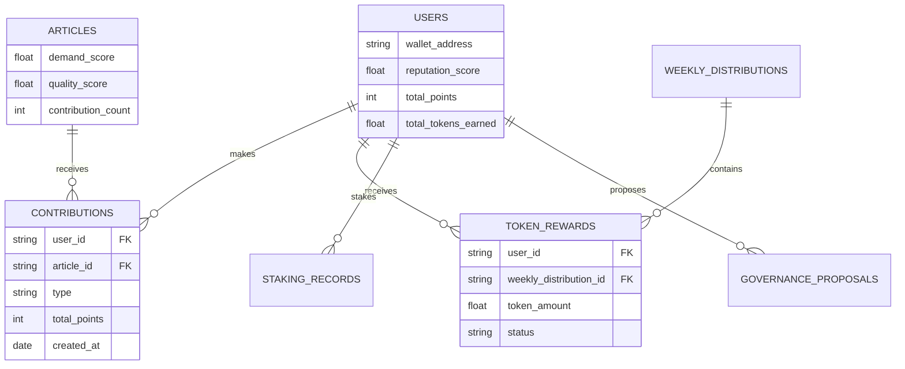

# Database Schema Changes for KONTRIB Token Integration

## Overview

This document outlines all the database schema changes needed to integrate the Wiki Contribution Token (KONTRIB) system with your existing BigKreators MongoDB database.

## Modified Collections

### 1. Users Collection (Existing - Extended)

**New Fields Added:**
```javascript
{
  // ... existing user fields ...
  
  // Token Integration Fields
  "wallet_address": "7xKXtg2CW87d97TXJSDpbD5jBkheTqA83TZRuJosgHDF", // Solana wallet
  "reputation_score": 1.2,           // Multiplier for rewards (0.8 - 1.5)
  "total_contributions": 15,         // Count of all contributions
  "total_points": 1500,              // Lifetime points earned
  "total_tokens_earned": 250.75,     // Lifetime KONTRIB tokens earned
  "staked_tokens": 100.0,            // Currently staked KONTRIB amount
  "governance_power": 200.0,          // Voting power (tokens + 2x staked)
  "last_reward_claim": ISODate("2024-12-16T00:00:00Z"), // Last reward claim
  "token_updated_at": ISODate("2024-12-16T10:30:00Z")   // Last token activity
}
```

**Indices Added:**
- `wallet_address` (unique, sparse)
- `reputation_score` (descending)
- `total_points` (descending)

### 2. Articles Collection (Existing - Extended)

**New Fields Added:**
```javascript
{
  // ... existing article fields ...
  
  // Token Integration Fields
  "demand_score": 1.5,               // Content demand multiplier (1.0 - 2.5)
  "quality_score": 2.0,              // Overall quality assessment
  "total_tokens_earned": 45.5,       // Total tokens earned by this article
  "contribution_count": 8,            // Number of contributions to this article
  "last_contribution_date": ISODate("2024-12-15T14:20:00Z"),
  "token_metadata": {
    "featured": false,               // Is this article featured?
    "high_demand": true,             // Is this a high-demand topic?
    "expert_reviewed": false         // Has this been expert reviewed?
  }
}
```

## New Collections

### 3. Contributions Collection

**Purpose:** Track all user contributions for point calculation

```javascript
{
  "_id": ObjectId("..."),
  "user_id": "507f1f77bcf86cd799439011",     // Reference to users._id
  "article_id": "507f1f77bcf86cd799439012",  // Reference to articles._id
  "type": "creation",                        // creation, major_edit, minor_edit, review, translation
  "base_points": 100,                        // Base points for contribution type
  "quality_multiplier": 2.5,                // Quality assessment (0.5 - 3.0)
  "reputation_multiplier": 1.2,             // User reputation at time of contribution
  "demand_multiplier": 1.8,                 // Content demand multiplier
  "total_points": 540,                       // Final calculated points
  "description": "Created comprehensive DeFi guide with examples",
  "metadata": {
    "word_count": 2500,
    "images_added": 3,
    "links_added": 12,
    "sources_cited": 8
  },
  "created_at": ISODate("2024-12-15T14:20:00Z"),
  "updated_at": ISODate("2024-12-15T14:20:00Z")
}
```

**Indices:**
- `user_id + created_at` (compound, descending on created_at)
- `article_id + created_at` (compound)
- `type` (ascending)
- `total_points` (descending)
- `created_at` (descending)

### 4. Token Rewards Collection

**Purpose:** Track individual token rewards for users

```javascript
{
  "_id": ObjectId("..."),
  "user_id": "507f1f77bcf86cd799439011",
  "weekly_distribution_id": "507f1f77bcf86cd799439013",
  "week_start": ISODate("2024-12-09T00:00:00Z"),
  "week_end": ISODate("2024-12-16T00:00:00Z"),
  "total_points": 540,                       // Points earned this week
  "token_amount": 85.5,                      // KONTRIB tokens awarded
  "staking_multiplier": 1.3,                 // Applied staking multiplier
  "transaction_signature": "3KqKCKXYrD8ZTbNMqUxvQRAyrZzDsGYdLVL9zYtAWWM",
  "status": "completed",                     // pending, processing, completed, failed
  "claimed_at": ISODate("2024-12-16T00:05:30Z"),
  "created_at": ISODate("2024-12-16T00:00:00Z")
}
```

**Indices:**
- `user_id + week_start` (compound)
- `weekly_distribution_id`
- `status`
- `created_at` (descending)

### 5. Weekly Distributions Collection

**Purpose:** Track weekly reward distribution events

```javascript
{
  "_id": ObjectId("..."),
  "week_start": ISODate("2024-12-09T00:00:00Z"),
  "week_end": ISODate("2024-12-16T00:00:00Z"),
  "total_points": 12500,                     // Total points across all users
  "total_tokens": 10000.0,                   // Total tokens distributed
  "point_to_token_ratio": 0.8,               // Tokens per point this week
  "user_count": 45,                          // Number of users receiving rewards
  "distribution_tx_hash": "5KqKCKXYrD8ZTbNMqUxvQRAyrZzDsGYdLVL9zYtAWWM",
  "status": "completed",                     // pending, processing, completed, failed
  "started_at": ISODate("2024-12-16T00:00:00Z"),
  "completed_at": ISODate("2024-12-16T00:08:45Z"),
  "created_at": ISODate("2024-12-16T00:00:00Z")
}
```

**Indices:**
- `week_start` (unique)
- `status`
- `created_at` (descending)

### 6. Staking Records Collection

**Purpose:** Track token staking activities

```javascript
{
  "_id": ObjectId("..."),
  "user_id": "507f1f77bcf86cd799439011",
  "amount": 1000.0,                          // Amount of KONTRIB staked
  "duration_days": 90,                       // Staking period (30, 90, 180, 365)
  "apy_rate": 0.12,                          // APY for this staking tier
  "multiplier": 1.3,                         // Reward multiplier for contributions
  "start_date": ISODate("2024-12-01T00:00:00Z"),
  "end_date": ISODate("2025-03-01T00:00:00Z"),
  "status": "active",                        // active, completed, unstaked_early
  "stake_tx_hash": "4KqKCKXYrD8ZTbNMqUxvQRAyrZzDsGYdLVL9zYtAWWM",
  "unstake_tx_hash": null,
  "rewards_earned": 15.5,                    // Staking rewards earned so far
  "created_at": ISODate("2024-12-01T00:00:00Z"),
  "updated_at": ISODate("2024-12-15T12:00:00Z")
}
```

**Indices:**
- `user_id + status` (compound)
- `end_date` (ascending)
- `created_at` (descending)

### 7. Governance Proposals Collection

**Purpose:** Track governance proposals and voting

```javascript
{
  "_id": ObjectId("..."),
  "title": "Increase Weekly Reward Pool to 15,000 KONTRIB",
  "description": "Proposal to increase the weekly reward pool from 10,000 to 15,000 KONTRIB to incentivize more contributions",
  "proposer_id": "507f1f77bcf86cd799439011",
  "proposal_type": "parameter_change",       // parameter_change, feature_request, treasury_allocation
  "parameters": {
    "parameter_name": "weekly_token_pool",
    "current_value": 10000,
    "proposed_value": 15000
  },
  "voting_start": ISODate("2024-12-16T00:00:00Z"),
  "voting_end": ISODate("2024-12-23T00:00:00Z"),
  "votes_for": 25000.0,                      // KONTRIB voting power for
  "votes_against": 8000.0,                   // KONTRIB voting power against
  "votes_abstain": 2000.0,                   // KONTRIB voting power abstaining
  "total_voting_power": 35000.0,             // Total KONTRIB that voted
  "quorum_required": 20000.0,                // Minimum voting power needed
  "status": "passed",                        // draft, active, passed, rejected, executed, cancelled
  "execution_tx_hash": "6KqKCKXYrD8ZTbNMqUxvQRAyrZzDsGYdLVL9zYtAWWM",
  "created_at": ISODate("2024-12-16T00:00:00Z"),
  "updated_at": ISODate("2024-12-23T00:05:00Z")
}
```

**Indices:**
- `proposer_id`
- `status`
- `voting_end` (ascending)
- `created_at` (descending)

### 8. System Config Collection

**Purpose:** Store token system configuration

```javascript
{
  "_id": "token_system",
  "contribution_types": {
    "creation": {"base_points": 100, "description": "Creating new wiki articles"},
    "major_edit": {"base_points": 50, "description": "Substantial content improvements"},
    "minor_edit": {"base_points": 20, "description": "Small fixes and formatting"},
    "review": {"base_points": 10, "description": "Reviewing edit proposals"},
    "translation": {"base_points": 75, "description": "Translating articles"}
  },
  "multipliers": {
    "quality": {"min": 0.5, "max": 3.0, "default": 1.0},
    "reputation": {"min": 0.8, "max": 1.5, "default": 1.0},
    "demand": {"min": 1.0, "max": 2.5, "default": 1.0}
  },
  "staking_tiers": {
    "30_days": {"apy": 0.05, "multiplier": 1.1},
    "90_days": {"apy": 0.12, "multiplier": 1.3},
    "180_days": {"apy": 0.25, "multiplier": 1.6},
    "365_days": {"apy": 0.50, "multiplier": 2.0}
  },
  "weekly_pool": 10000.0,
  "min_tokens_per_user": 1.0,
  "updated_at": ISODate("2024-12-16T00:00:00Z")
}
```

## Migration Steps

### Step 1: Run Database Migration Script

```bash
# Run the migration script
python migrate_database.py
```

### Step 2: Verify Collections

```bash
# Connect to your MongoDB and verify
mongo your-connection-string

# List collections
show collections

# Check new collections
db.contributions.countDocuments()
db.token_rewards.countDocuments()
db.weekly_distributions.countDocuments()
db.staking_records.countDocuments()
db.governance_proposals.countDocuments()
```

### Step 3: Test Token Fields

```javascript
// Check updated user documents
db.users.findOne({}, {wallet_address: 1, reputation_score: 1, total_points: 1})

// Check updated article documents  
db.articles.findOne({}, {demand_score: 1, quality_score: 1, token_metadata: 1})
```

## Data Relationships



## Database Performance Considerations

### Indexing Strategy
1. **Compound indices** for common query patterns
2. **Sparse indices** for optional fields like wallet_address
3. **TTL indices** for temporary data (if needed)

### Query Optimization
1. **User rewards**: `user_id + created_at` for timeline queries
2. **Weekly distributions**: `week_start` for unique weeks
3. **Staking lookups**: `user_id + status` for active stakes

### Data Retention
1. **Contributions**: Keep all records for reputation calculation
2. **Token rewards**: Keep all for tax/audit purposes
3. **Weekly distributions**: Archive old records after 1 year
4. **Governance**: Keep all proposals for transparency

## Backup Strategy

### Critical Collections (High Priority)
- `users` - User accounts and wallet addresses
- `contributions` - All contribution history
- `token_rewards` - Financial records
- `staking_records` - Staking positions

### Configuration Collections (Medium Priority)
- `system_config` - System parameters
- `governance_proposals` - Governance history

### Generated Collections (Low Priority)
- `weekly_distributions` - Can be recalculated

## Migration Rollback Plan

If migration needs to be rolled back:

```javascript
// Remove token fields from users
db.users.updateMany({}, {
  $unset: {
    wallet_address: "",
    reputation_score: "",
    total_contributions: "",
    total_points: "",
    total_tokens_earned: "",
    staked_tokens: "",
    governance_power: "",
    last_reward_claim: "",
    token_updated_at: ""
  }
})

// Remove token fields from articles
db.articles.updateMany({}, {
  $unset: {
    demand_score: "",
    quality_score: "",
    total_tokens_earned: "",
    contribution_count: "",
    last_contribution_date: "",
    token_metadata: ""
  }
})

// Drop new collections
db.contributions.drop()
db.token_rewards.drop()
db.weekly_distributions.drop()
db.staking_records.drop()
db.governance_proposals.drop()
```

## Post-Migration Testing

### Functional Tests
1. Create a test contribution
2. Calculate points correctly
3. Process weekly distribution
4. Stake and unstake tokens
5. Create governance proposal

### Performance Tests
1. Query user contributions (should be < 100ms)
2. Calculate weekly rewards (should be < 5 seconds)
3. Load user dashboard (should be < 200ms)

### Data Integrity Tests
1. Verify point calculations
2. Check token balance consistency
3. Validate staking records
4. Confirm governance voting power

This completes the database schema changes needed for KONTRIB token integration. The migration script handles all these changes automatically.
